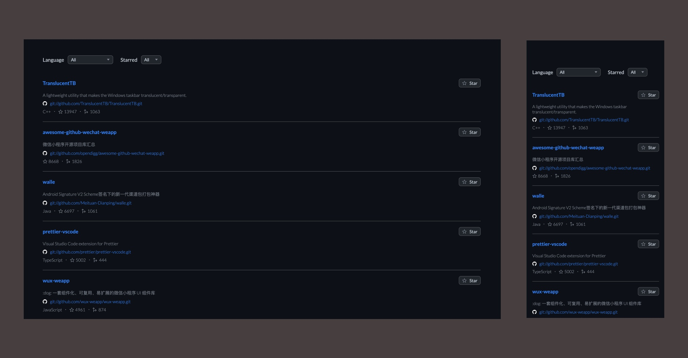

## Github repositories

Welcome to my GitHub repositories project!

This project focuses on implementing a Custom Data Grid component that dynamically creates filters based on the received data model and renders the list items. Additionally, I have dedicated time to designing the user interface.



## Installation

Run the project after installing the dependencies, then open the printed link on your browser!

```sh
npm install
npm run dev
```

Tests should be run as follows:

```sh
npm run test
```

Static checking of the code with JSlint

```sh
npm run lint
```
